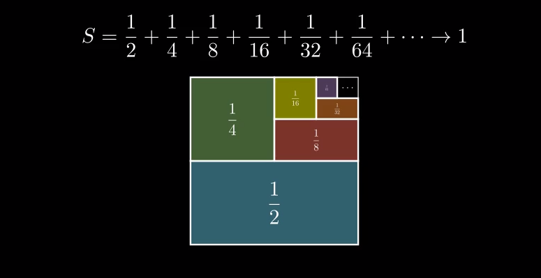

# Manim Video Scripts

A collection of videos created using manim.

example:  

## prereqs

* python
* ffmpeg
* latex

## installation guide link

https://docs.manim.community/en/stable/installation/windows.html

## usage

`manim -pql <script_name>.py <SceneName>`
